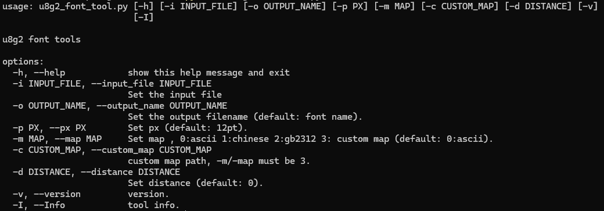
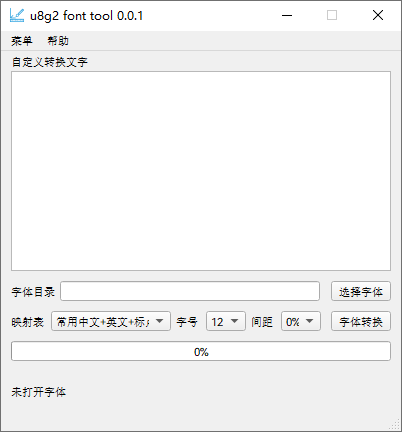

**English** | [中文](./README_zh.md) 

# u8g2_font_tool

github: [PeakRacing/u8g2_font_tools](https://github.com/PeakRacing/u8g2_font_tool)

gitee: [u8g2_font_tool: u8g2 字体制作工具](https://gitee.com/PeakRacing/u8g2_font_tool)

## Introduction
U8G2 Font Make Tool supports graphical + command line mode 

Development reason: Solve the problem that the OTF2BDF tool does not handle some fonts well, resulting in the misalignment of individual characters

**Font support format**：TTF、OTF
**Output file**: bdf、tga、u8g2 bin文件、u8g2 c代码文件

Platform Support:

- [x] Windows

- [x] Linux

- [ ] Mac

## Software Architecture
Developed based on pyside6 + freetype3

## showcase

### shell version：

### UI version:

## Discussion group

​	**Non-technical support, only for the purpose of interest exchange.**

