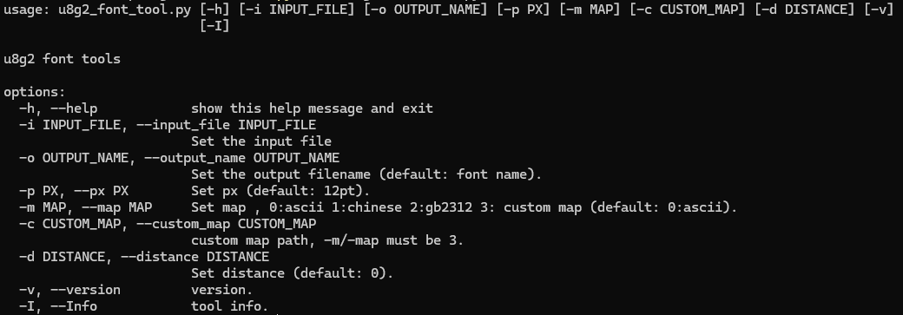
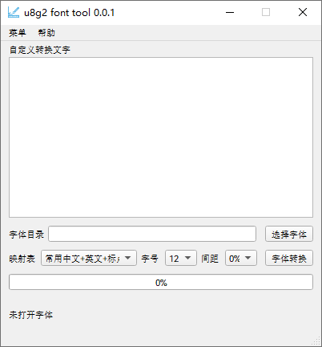

[**English**](./README.md)  | **中文**

# u8g2_font_tool

## 介绍
u8g2 字体制作工具 支持图形化+命令行模式 
开发原因:解决otf2bdf 工具对某些字体处理不好,导致个别字符错位问题

平台支持情况:

- [x] Windows

- [x] Linux

- [ ] Mac

## 软件架构
基于 pyside6 + freetype3 开发

## 运行展示

### shell版本：

### UI版本:

